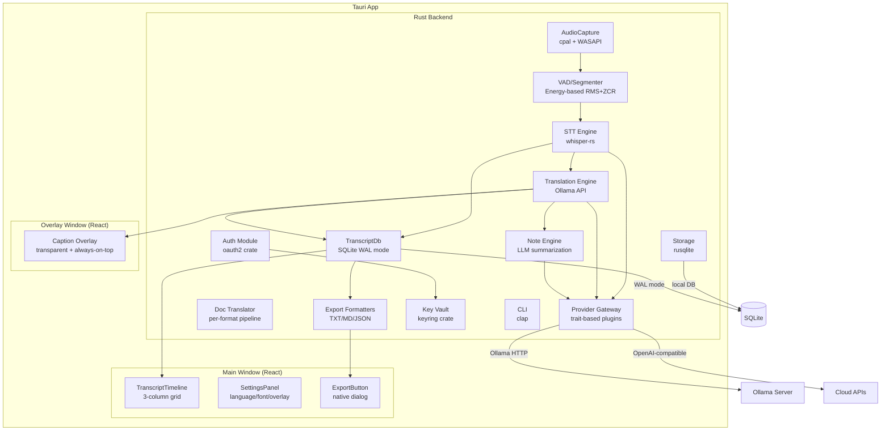
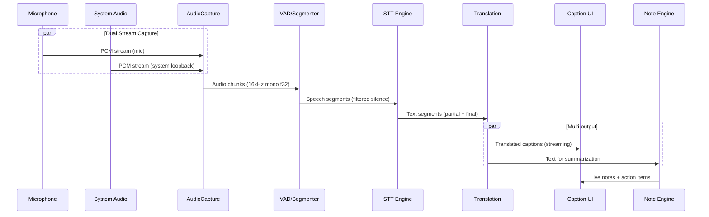

# Kiến Trúc Hệ Thống

> Real-Time Multilingual Meeting Translator & Notetaker

## 1. Tổng Quan

Ứng dụng desktop xây dựng trên **Rust (Tauri v2)** với frontend **React/TypeScript**. Chạy offline-first với **whisper.cpp** (STT) và **Ollama** (LLM translation/notes). Chi phí vận hành ~0$.

### Tech Stack

| Layer | Công nghệ |
|-------|-----------|
| Core runtime | Rust (Edition 2021) + tokio async |
| Desktop GUI | Tauri v2 (Rust backend + React webview) |
| Frontend | React 19 + TypeScript + Tailwind CSS |
| STT | whisper-rs (whisper.cpp binding) |
| LLM | Ollama HTTP API (localhost:11434) |
| Audio | cpal + WASAPI loopback (Windows) / CoreAudio (macOS) |
| Storage | rusqlite (SQLite) |
| Security | keyring (OS keychain) |

## 2. Component Diagram



## 3. Data Flow Pipeline



## 4. Tech Mapping Chi Tiết

| Module | Crate/Package | Vai trò | Ghi chú |
|--------|--------------|---------|---------|
| AudioCapture | `cpal` 0.17 | Thu audio mic + system | WASAPI loopback (Win); Arc<Mutex> stt_tx for pipeline |
| Resampler | `rubato` 1.0 | Audio resampling | 44.1/48kHz → 16kHz mono (Fft mode) |
| VAD | Energy-based (RMS+ZCR) | Phát hiện giọng nói, cắt đoạn | SpeechBuffer with 30s cap; no external deps |
| STT Engine | `whisper-rs` 0.15.1 | Speech-to-text sync + async | Model GGML, 16kHz mono; best_of: 1 for greedy sampling |
| Model Manager | `reqwest` 0.12 + HuggingFace | Download models from CDN | Progress events, temp file handling, retry logic |
| STT Pipeline | std::thread | Orchestrator VAD→resample→STT→emit | JoinHandle for clean shutdown, dedicated thread (not tokio) |
| Translation | `reqwest` → Ollama | Dịch multi-lang via LLM | Native /api/chat endpoint (streaming NDJSON) |
| TranscriptDb | `rusqlite` + WAL | Thread-safe storage | Arc<Mutex<Connection>>, WAL mode for concurrency |
| Export Formatters | Strategy pattern | Export TXT/MD/JSON | ExportFormat trait, TxtFormatter/MdFormatter/JsonFormatter |
| Caption Overlay | React + Tauri | Overlay always-on-top | Transparent window, no decorations, cross-window events |
| SettingsPanel | React + shadcn/ui | Settings UI | Target language, font size, overlay toggle |
| TranscriptTimeline | React component | 3-column display | Time / Original / Translation grid with auto-scroll |
| ExportButton | React + tauri-plugin-dialog | Native save dialog | Invoke export_transcript command |
| Note Engine | `reqwest` → Ollama | Tóm tắt, action items | Incremental summarization qua Provider Gateway (Phase 2) |
| Doc Translator | `docx-rs`, `calamine`, `lopdf` | Dịch file giữ format | Per-format pipeline |
| Provider Gateway | Rust traits | Abstraction cho AI providers | Ollama, OpenAI-compatible, custom endpoints |
| Auth | `oauth2` | Login/SSO | Email/password + Google OAuth |
| Key Vault | `keyring` 3.6 | Lưu key an toàn | OS keychain (DPAPI/Win, Keychain/mac) |
| Storage | `rusqlite` 0.38 | Local DB | Transcript, notes, settings, history |
| CLI | `clap` 4.x | Command-line interface | Batch translation, headless mode |

**Crates chung:** `tokio` 1.x (async), `serde` 1.x (serialization), `tracing` 0.1 (logging), `thiserror` 1.x + `anyhow` 1.x (errors)

### UI Component Library (shadcn/ui - v0.7.1)

| Component | Sử dụng tại | Vai trò |
|-----------|------------|---------|
| Select | AudioDeviceSelector | Device selection với Mic icon |
| Slider | SettingsPanel | Font size control (min/max/step props) |
| AlertDialog | NotesPanel | Delete confirmation modal |
| Tooltip | SettingsPanel | Language pills hover hints |
| Badge | TranscriptTimeline | LIVE indicator badge |
| Separator | Various panels | Visual section dividers |
| Sonner (Toast) | Global | User feedback (success/error notifications) |
| Button | All components | Primary UI actions (variant + size props) |

**Icons (lucide-react):** Languages, Moon, Sun, FileText, FileCode, Mic, Trash2, Pencil, Check, X, Loader2

## 5. IPC Design (Rust ↔ React)

### Tauri Commands (Request-Response)
```rust
// Rust side (Sprint 5 commands)
#[tauri::command]
async fn start_meeting(src_lang: String, tgt_lang: String) -> Result<String, String>;

#[tauri::command]
async fn stop_meeting() -> Result<String, String>; // Returns meeting_id

#[tauri::command]
async fn export_transcript(meeting_id: String, format: String, path: String) -> Result<(), String>;

#[tauri::command]
async fn show_overlay_window(app: AppHandle) -> Result<(), String>;

#[tauri::command]
async fn hide_overlay_window(app: AppHandle) -> Result<(), String>;

#[tauri::command]
async fn list_ollama_models() -> Result<Vec<ModelInfo>, String>;
```

### Tauri Events (Streaming, Fire-and-Forget)
```rust
// Rust → React streaming (Sprint 5 events)
app.emit("stt-partial", SttEventPayload { text, is_final: false });
app.emit("stt-final", SttEventPayload { text, is_final: true, segment_id });
app.emit("translation-update", TranslationUpdate { segment_id, translated_text });
app.emit("caption-update", CaptionPayload { text, timestamp }); // Cross-window to overlay
app.emit("meeting-started", MeetingStarted { meeting_id });
```

### Tauri Channel (High-throughput streaming)
```rust
// Dùng Channel type cho audio pipeline — tránh JSON overhead
#[tauri::command]
async fn stream_captions(channel: Channel<CaptionPayload>) -> Result<(), String>;
```

## 6. Concurrency Model

### Phase 1-2 (Audio → STT) - std::thread Model
```
SttPipeline (dedicated std::thread)
├── VAD module (RMS + ZCR detection)
├── AudioResampler (44.1/48kHz → 16kHz)
├── SttEngine (whisper-rs 0.15.1)
└── Tauri event emitter (stt-partial, stt-final)

AudioCaptureManager (tokio task)
└── Arc<Mutex<mpsc::Sender>> to SttPipeline
```

JoinHandle stored in SttPipeline for clean thread shutdown. Backpressure via bounded channels.

### Phase 2+ (Translation → Notes) - tokio Model
```
tokio Runtime
├── Translation Task (recv text → Ollama API → send translated)
├── Note Task (recv transcript → periodic summarization)
├── IPC Task (emit events to React frontend)
└── Storage Task (batch write to SQLite)
```

`tokio::sync::mpsc` channels giữa các task. Bounded channels provide backpressure.

## 7. Directory Structure

```
rt-translator/
├── src-tauri/                    # Rust backend (Tauri)
│   ├── src/
│   │   ├── main.rs              # Entry point
│   │   ├── lib.rs               # Shared library
│   │   ├── commands/            # Tauri IPC commands
│   │   │   ├── mod.rs
│   │   │   ├── audio.rs         # audio device/capture (Sprint 2)
│   │   │   ├── stt.rs           # STT commands (Sprint 3)
│   │   │   ├── translation.rs   # translation commands (Sprint 4)
│   │   │   ├── export.rs        # export transcript (Sprint 5)
│   │   │   ├── overlay.rs       # overlay window (Sprint 5)
│   │   │   ├── meeting.rs       # start/stop meeting
│   │   │   ├── notes.rs         # note management (Sprint 7)
│   │   │   └── settings.rs      # app settings
│   │   ├── audio/               # Audio capture + VAD
│   │   │   ├── mod.rs
│   │   │   ├── capture.rs       # cpal audio capture
│   │   │   └── vad.rs           # voice activity detection
│   │   ├── stt/                 # Speech-to-text
│   │   │   ├── mod.rs
│   │   │   └── whisper.rs       # whisper-rs wrapper
│   │   ├── translation/         # Translation engine
│   │   │   ├── mod.rs
│   │   │   └── pipeline.rs      # text → translated text
│   │   ├── notes/               # Note engine ✅ SPRINT 7
│   │   │   ├── mod.rs
│   │   │   ├── note_engine.rs      # NoteEngine orchestrator
│   │   │   ├── ollama_summarizer.rs # LLM summarizer
│   │   │   ├── prompt_templates.rs  # Prompt engineering
│   │   │   ├── note_types.rs        # Serde types
│   │   │   └── memo_builder.rs      # Memo formatter
│   │   ├── providers/           # AI provider gateway
│   │   │   ├── mod.rs
│   │   │   ├── traits.rs        # Provider trait definition
│   │   │   ├── ollama.rs        # Ollama implementation
│   │   │   └── openai.rs        # OpenAI-compatible
│   │   ├── storage/             # Database + file storage
│   │   │   ├── mod.rs
│   │   │   ├── transcript_store.rs # TranscriptDb (Sprint 5)
│   │   │   ├── note_store.rs       # NoteStore CRUD (Sprint 7)
│   │   │   ├── migrations.rs       # DB migrations V1-V4 (Sprint 7)
│   │   │   └── models.rs           # data models
│   │   ├── auth/                # Authentication
│   │   │   ├── mod.rs
│   │   │   └── oauth.rs         # Google OAuth
│   │   └── security/            # Key vault + encryption
│   │       ├── mod.rs
│   │       └── keyring.rs       # OS keychain wrapper
│   ├── Cargo.toml
│   └── tauri.conf.json
├── src/                          # React frontend
│   ├── App.tsx
│   ├── main.tsx
│   ├── overlay/                 # Overlay window (Sprint 5)
│   │   ├── overlay.tsx          # Overlay entry point
│   │   └── overlay.html         # Overlay HTML template
│   ├── components/
│   │   ├── settings-panel.tsx      # Settings UI (Sprint 5)
│   │   ├── transcript-timeline.tsx # Transcript display (Sprint 5)
│   │   ├── export-button.tsx       # Export UI (Sprint 5)
│   │   ├── notes-panel.tsx         # AI notes UI (Sprint 7)
│   │   ├── memo-export-button.tsx  # Memo export (Sprint 7)
│   │   └── ui/                     # shadcn/ui components
│   ├── hooks/                   # Custom React hooks
│   │   └── use-note-events.ts  # Note event listener (Sprint 7)
│   ├── stores/                  # zustand stores
│   ├── lib/                     # Utilities
│   └── types/                   # TypeScript types
│       └── notes.ts             # Note types (Sprint 7)
├── docs/                         # Documentation
├── plans/                        # Implementation plans
└── package.json
```

## 8. Ollama API Integration

```
Base URL: http://localhost:11434

Endpoints sử dụng:
- POST /v1/chat/completions  → Translation + Notes (OpenAI-compatible, streaming)
- POST /api/generate         → Simple text generation
- GET  /api/tags             → List installed models
- POST /api/pull             → Download model
- DELETE /api/delete         → Remove model
```

Streaming response format: NDJSON (`{"choices":[{"delta":{"content":"..."}}]}`).

## 9. Security Architecture

- **Key storage**: OS keychain via `keyring` (DPAPI trên Windows, Keychain trên macOS)
- **Data at rest**: SQLite database encrypted với master key từ OS vault
- **Network**: TLS cho mọi external API calls; localhost Ollama không cần auth
- **Audio data**: Không lưu raw audio mặc định; chỉ lưu transcript
- **API keys**: Không hardcode; lưu trong OS keychain, inject at runtime

## Sprint 7 Notes Pipeline

### Note Engine Architecture
```rust
Frontend: get_notes / update_note / delete_note / generate_memo / export_memo commands
  → NoteEngine orchestrator
    ├── OllamaSummarizer::summarize()
    │   ├── Prompt engineering (system + category prompts)
    │   ├── POST /api/chat (Ollama API)
    │   └── Parse LLM response
    ├── NoteStore CRUD operations
    │   ├── insert_note()
    │   ├── update_note()
    │   ├── delete_note()
    │   └── get_notes_by_meeting()
    └── Emit "notes-updated" events
      → Frontend useNoteEvents hook
        → Update Zustand notes slice
          → NotesPanel renders 4-tab UI
```

### Note Categories & Prompt Templates
```rust
// 4 note categories
enum NoteCategory {
    KeyPoints,      // Main discussion points
    Decisions,      // Decisions made
    ActionItems,    // Tasks/todos
    Risks,          // Potential issues
}

// Prompt structure
System Prompt: Context about meeting, transcript history
Category Prompt: Specific instructions for each category
LLM Response: Structured note content
```

### Database Schema V4
```sql
CREATE TABLE notes (
    id INTEGER PRIMARY KEY AUTOINCREMENT,
    meeting_id TEXT NOT NULL,
    category TEXT NOT NULL,  -- key_points, decisions, action_items, risks
    content TEXT NOT NULL,
    created_at INTEGER NOT NULL,
    updated_at INTEGER NOT NULL,
    FOREIGN KEY (meeting_id) REFERENCES meetings(id) ON DELETE CASCADE
);
```

### Meeting Memo Format
```markdown
# Meeting Memo: {meeting_id}
Generated: {timestamp}

## Key Points
- Point 1
- Point 2

## Decisions Made
- Decision 1
- Decision 2

## Action Items
- [ ] Task 1
- [ ] Task 2

## Risks & Concerns
- Risk 1
- Risk 2
```

## Sprint 5 Implementation Details

### Multi-page Vite Build
```typescript
// vite.config.ts
export default defineConfig({
  build: {
    rollupOptions: {
      input: {
        main: resolve(__dirname, 'index.html'),
        overlay: resolve(__dirname, 'src/overlay/overlay.html')
      }
    }
  }
});
```

**Windows:**
- `main` - Main app window (App.tsx)
- `overlay` - Caption overlay (overlay.tsx, transparent, always-on-top, no decorations)

### Database Schema V2
```sql
CREATE TABLE transcripts (
    id INTEGER PRIMARY KEY AUTOINCREMENT,
    meeting_id TEXT NOT NULL,
    segment_id TEXT UNIQUE NOT NULL, -- NEW in V2
    timestamp INTEGER NOT NULL,
    original_text TEXT NOT NULL,
    translated_text TEXT,
    FOREIGN KEY (meeting_id) REFERENCES meetings(id)
);
```

**segment_id format:** `{meeting_id}:{index}` (canonical, generated in Rust)

### Export Format Strategy Pattern
```rust
trait ExportFormat {
    fn format(&self, segments: Vec<TranscriptSegment>) -> String;
}

struct TxtFormatter;  // Plain text with timestamps
struct MdFormatter;   // Markdown table
struct JsonFormatter; // Structured JSON
```

### Cross-Window Communication
```rust
// Main window → Overlay window
app_handle.emit("caption-update", CaptionPayload {
    text: translated_text,
    timestamp: current_timestamp,
})?;

// Overlay listens
listen("caption-update", |event| {
    // Update overlay UI
});
```

## v0.7.1 UI/UX Polish

### App Header Enhancements
```typescript
// App layout với recording indicator + dark mode toggle
<header className="sticky top-0 z-50 flex h-12 items-center justify-between border-b bg-background/80 backdrop-blur-sm">
  <div className="flex items-center gap-2">
    <Languages className="h-5 w-5 text-primary" />
    <h1>RT Translator</h1>
    {isTranscribing && (
      <div className="flex items-center gap-1.5">
        <div className="h-2 w-2 animate-pulse rounded-full bg-red-500" />
        <span className="text-xs">Recording</span>
      </div>
    )}
  </div>
  <Button variant="ghost" size="icon" onClick={toggleDarkMode}>
    {isDark ? <Sun /> : <Moon />}
  </Button>
</header>
```

### Component Modularization
- **NoteCard.tsx** (197 lines): Extracted từ notes-panel.tsx
  - Inline editing: Pencil → textarea → Check/X buttons
  - Delete confirmation: AlertDialog với "Are you sure?" message
  - Toast feedback: Success/error notifications via Sonner

### Visual Feedback Patterns
- **Loading states**: Loader2 spinner trên buttons khi async operation
- **Empty states**: Icon + placeholder text khi no data
- **Copy actions**: Toast "Copied to clipboard" confirmation
- **CRUD operations**: Toast notifications cho create/update/delete
- **File exports**: FileText/FileCode icons + loading spinner

### Config Fix (tauri.conf.json)
```diff
- "preload": {
-   "sqlite:translator.db": [...]
- }
+ "preload": ["sqlite:translator.db"]
```
Previous map format caused panic on startup. Fixed to array format.

## Câu Hỏi Chưa Giải Quyết

1. ~~**WASAPI loopback**~~ ✅ Resolved: wasapi 0.22 with Render device + Capture direction
2. ~~**whisper-rs streaming**~~ ✅ Resolved: Chunked processing via VAD, not streaming
3. **Dual audio sync**: Timestamp synchronization giữa mic và system audio (deferred to hardening sprint)
4. **Ollama bundling**: Embed runtime hay yêu cầu user cài sẵn? (Phase 3 packaging decision)
5. **Model integrity**: SHA256 verification for downloaded models (deferred to hardening sprint)
